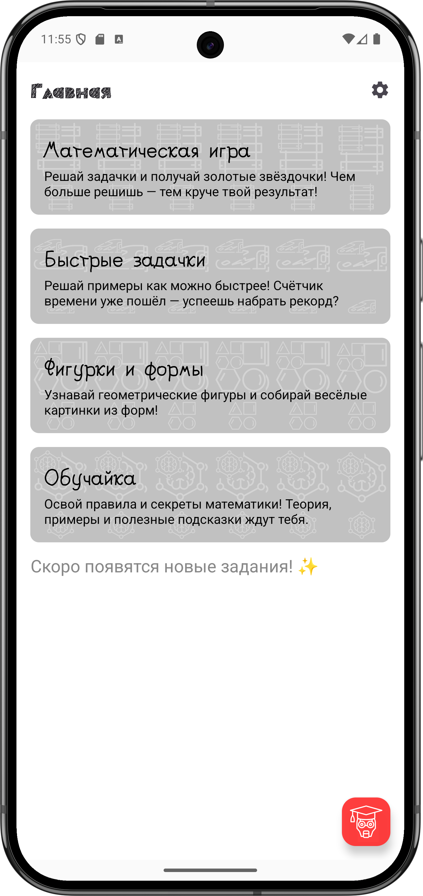
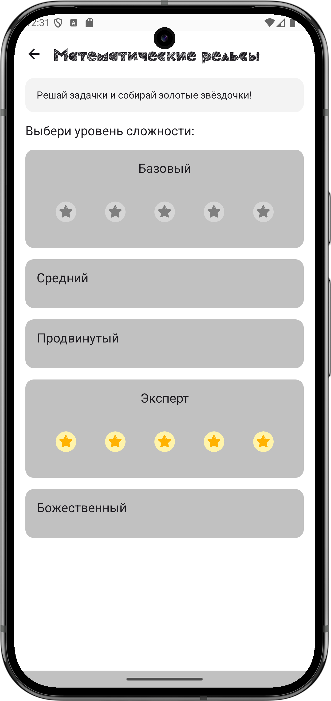
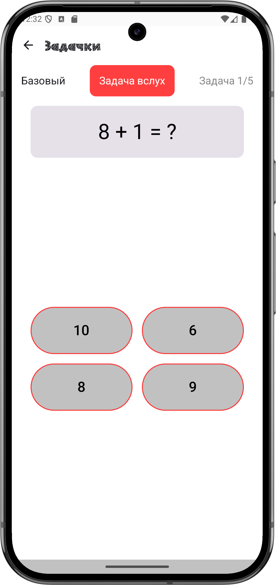
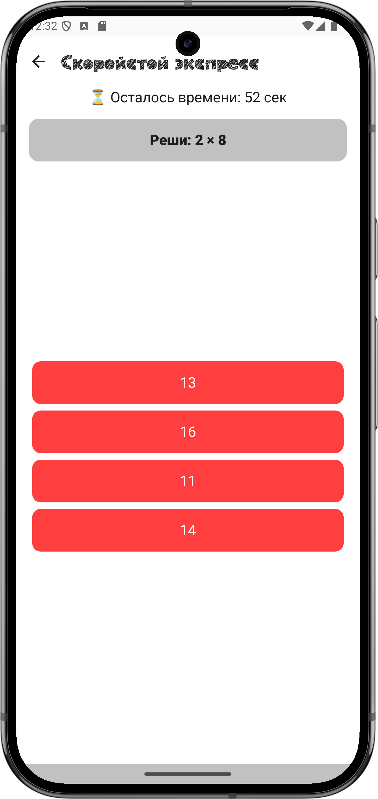
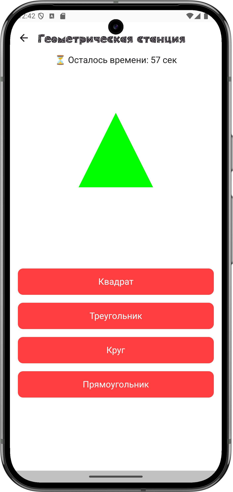
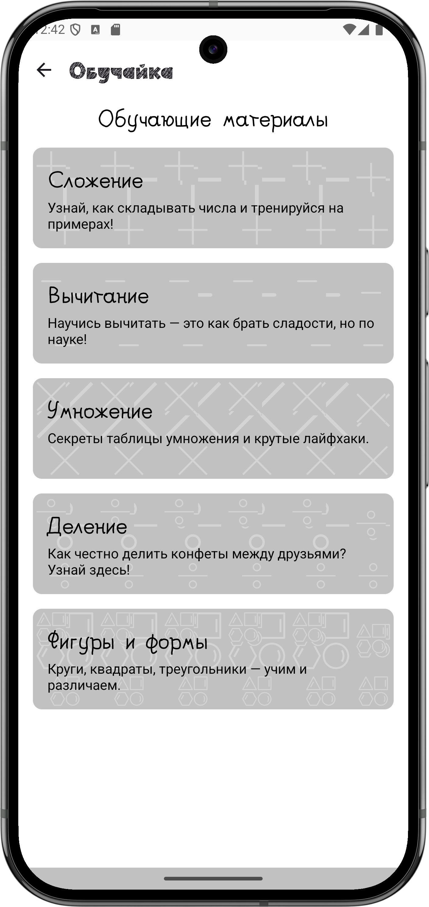
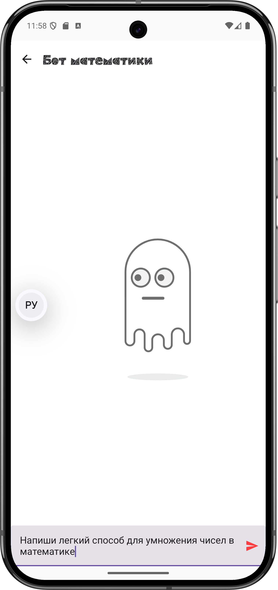
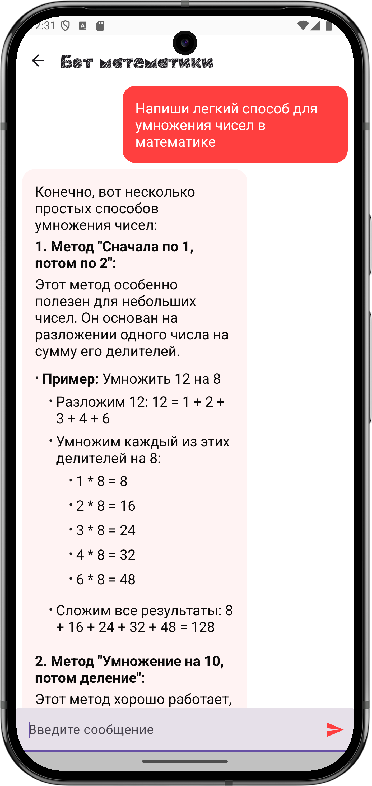

# DiplomV2
<h1 align="center">📱 МатеМагия: Обучающее Приложение по Математике</h1> 

  Интерактивное образовательное приложение для детей — учим математику и геометрию весело и с интересом!

---

## 📖 О проекте

**МатеМагия** — это мобильное Android‑приложение, разработанное для увлекательного изучения математики через игру. Оно предлагает обучающие режимы, мини-игры, подсказки, бота-помощника и визуальную статистику, чтобы сделать процесс обучения максимально эффективным и приятным для детей младшего возраста.

---

## ✨ Основные возможности

| Раздел | Описание |
|--------|----------|
| 🚂 **Математические рельсы** | Решайте задачки и собирайте золотые звёздочки! Чем больше решишь — тем длиннее поезд! |
| 🚄 **Скоростной экспресс** | Успейте решить максимум примеров до прибытия поезда на станцию! |
| 🏗️ **Геометрическая станция** | Собирайте геометрические фигуры как пазлы — круглые колёса, квадратные окошки и многое другое! |
| 📚 **Обучайка** | Раздел с теорией, примерами и подсказками для лучшего понимания математических тем. |
| 🤖 **Бот-помощник** | Интерактивный AI-помощник по математике, который отвечает на вопросы и помогает с задачами. |
| 📊 **Статистика и достижения** | Отслеживайте прогресс и открывайте награды за успехи. |

---

## 🧮 Темы обучения

- Сложение  
- Вычитание  
- Умножение  
- Деление  
- Геометрические фигуры  

---

## 🛠️ Технический стек

### Языки и инструменты
- 🤖 **Kotlin** — основной язык разработки
- 🔧 **Gradle** — система сборки

### Архитектура и библиотеки
| Библиотека | Назначение |
|------------|------------|
| 🔗 **Jetpack Compose** | Создание UI с декларативным подходом |
| 💾 **Room Database** | Работа с локальной базой данных |
| 🔧 **Ktor** | Сетевые запросы |
| ⛓️ **Navigation Compose** | Навигация между экранами |
| 🔩 **Material 3** | Современный дизайн по стандартам Material |
| 🔑 **Kotlinx Serialization** | Сериализация и десериализация данных |
| 👀 **Lottie Compose** | Анимации |
| 📝 **Markdown Renderer** | Отображение Markdown (в AI-боте) |
| 📊 **Compose Charts** | Визуализация данных и статистики |

---

## 📱 Скриншоты

  
  
  
  
  
  
  
  

---

## 🚀 Установка и запуск

1. Загрузите последнюю версию **APK** из раздела [Releases](https://github.com/Egor228000/DiplomV2/releases)
2. Установите APK на ваше Android‑устройство
3. Запустите приложение "МатеМагия"
